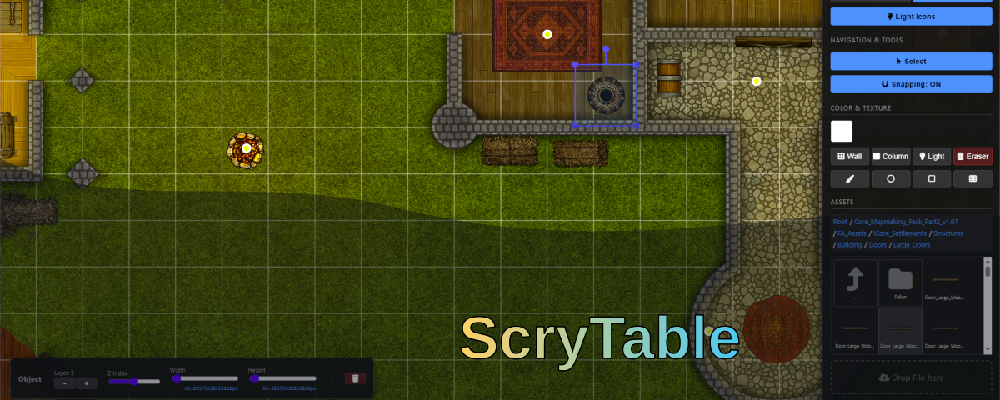
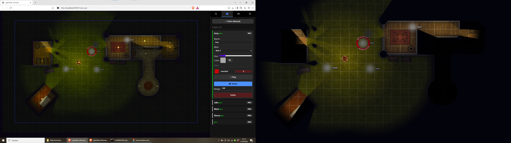
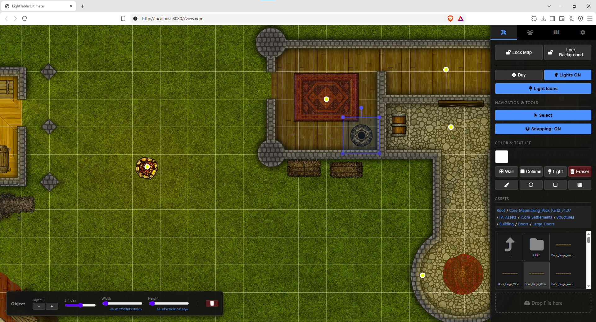
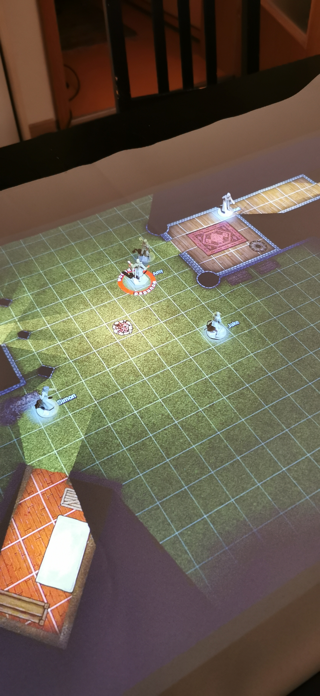
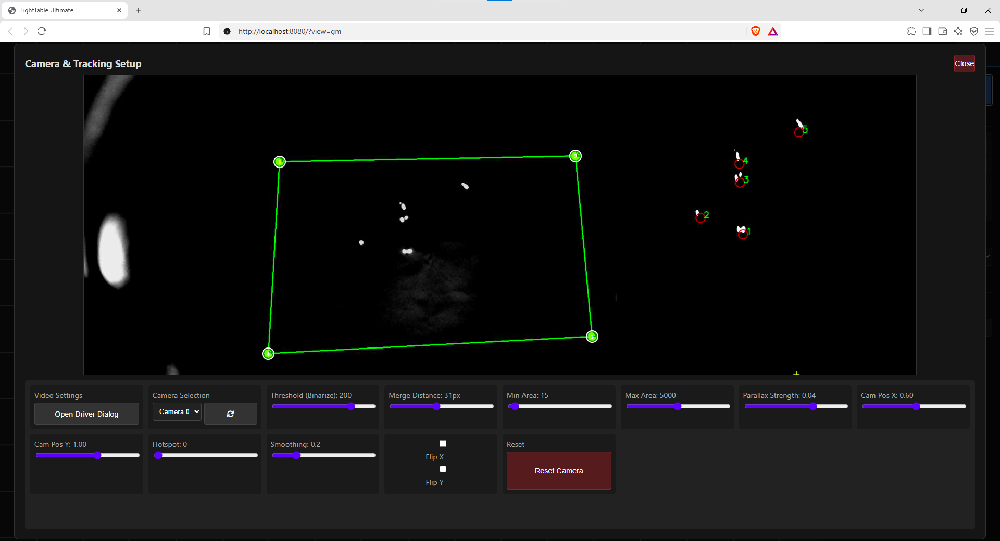
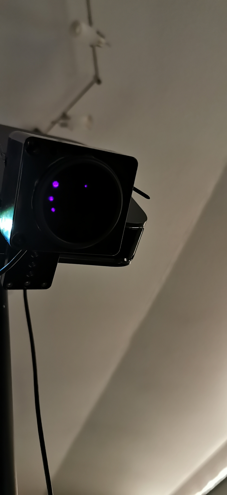

<p align="center">
  
</p>

> 🌐 **Language / Sprache:** [English](README.md) · [Deutsch](README.de.md)

**ScryTable** is an interactive Virtual Tabletop (VTT) for tabletop RPG sessions. It is projected from above onto the gaming table via a beamer, turning the physical table into a living game world.

- **GM view** for building and controlling the map (in the game master's browser).
- **Player views** that can simply be opened in a browser – e.g. on an Android TV stick connected to the beamer.
- **OS-independent** (everything runs in the browser, the server is Python).
- **IR blob tracking** with a camera to automatically track real miniatures on the table.
- **Multilingual** – English (default) and German.

---

## Features

### Editor
- **Layer system** – objects/walls/columns are rendered by Z-index and can be moved between background and foreground (`mapLow`, `objectsHigh`).
- **Asset manager** – downloaded assets (e.g. from *Forgotten Adventures*) are managed in a folder browser, sorted into subfolders, and placed by click or drag & drop.
- **Walls & columns** – drawable walls (straight or curved, with texture/width) and polygonal columns. Walls can be "invisible" and act as sight/collision blockers.
- **Lighting system** – placeable light sources with radius, brightness, falloff, color, flicker effect and light icons. Day/night toggle with a smooth transition.
- **Drawing tools** – brush (stroke), rectangle, circle and grid fill, each with color or texture.
- **Background image** – uploadable map image with scaling, repeat and position.
- **Grid & snapping** – adjustable grid, magnetic alignment when placing and moving.

### View & Fog of War (FoW)
- **GM view + Player view** – the GM sees everything and can freely move the player view; players only see their viewport.
- **Fog of War** in two modes:
  - **Mode 2 (temporary):** only the current viewport is visible.
  - **Mode 1 (permanent):** explored areas stay revealed ("memory").
- **Visibility calculation** based on walls/columns (real occlusion, no artificial penetration) with a soft vision edge per token with vision.
- **FoW brush** for manual reveal/hide.

### Figure Tracking (Blob Tracking)
- **IR camera tracking:** camera with IR filter lens + IR emitters; figures carry small reflective surfaces.
- **Correction options:** threshold/binarization, merge distance, min/max area, hotspot compensation, parallax correction, smoothing, flip X/Y.
- **Camera calibration** via four draggable corner points in a live preview.
- **Blob tracking** with anchor/teleport logic, ID assignment, loss and re-find handling.
- **Tokens** with size, color/spotlight, name, rings with text, vision range and blink function.

### Turn-based Correction (stabilizing blob assignment)
The base tracking works well when a single figure moves while others are briefly occluded.
When more than one figure moves while blobs are occluded, the greedy teleport logic can swap
blob IDs (the camera sees no identity). A **conservative correction layer** sits on top of
the tracking:

- It continuously records the positions of visible blobs (a "snapshot").
- When a disturbance is detected (a blob disappears), the snapshot is frozen.
- As soon as **all** blobs are visible again, "before" is compared with "after":
  - A blob at the same position → unchanged, still belongs to the same token.
  - A blob at a new position → belongs to the token whose old blob vanished (that figure moved).
- Only **blob IDs are permuted** (never created or deleted) → the ID set stays stable, so the
  client does not create/delete tokens (no jumping back and forth).
- Unmoved / never-occluded figures are never touched.
- **Ambiguity (confusion risk):** When several blobs move within a **tight area** (dense figure
  cluster), the assignment is unclear. Then the most likely variant (minimum total movement) is
  assumed and the GM is shown a notice listing the affected figures (token name, otherwise blob
  ID). An **"Apply alternative"** button, with exactly 2 moved blobs, immediately applies the only
  other distribution (swapping the two tokens). Movements in **widely separated** figure groups
  are considered reliable (cross movement over a large distance is very unlikely) and trigger
  **no** notice.
- **Multiple notices:** New uncertainty notices do **not** overwrite each other – they queue up and
  the GM works through them one by one (a counter shows how many are pending). Each notice has an
  **auto-timeout of 30 seconds**: if it is not handled in time (via "Apply alternative" or
  "Dismiss"), it disappears by itself without changing the assignment. The 30 s give the GM time
  to first check the projected table.

The behavior can be tuned via the constants in `TurnCorrectionLayer.__init__` (in
`scrytable.py`): `anchor_radius`, `moved_threshold`, `max_disruption` and
`uncertainty_gap` (threshold for the spatial closeness of the moved blobs).

### Player View / Blackout / Media
- **Blackout function:** instantly darken the player view so the GM can prepare unnoticed.
- **Media system:** play images and videos through the blackout function in **Full**, **Split** or **Quad** layout – including flip and loop per slot.
- **Status info & names** projected next to figures.

---

## Requirements

| Component | Requirement |
|-----------|-------------|
| **OS** | Windows / Linux / macOS (server) |
| **Python** | 3.8 or newer |
| **Browser** | Current Chrome / Firefox / Edge (WebGL) |
| **Camera** | Webcam, ideally with IR filter lens |
| **Player device** | Any browser (e.g. Android TV, tablet, laptop) |

---

## Installation

### 1. Download the project

```bash
git clone https://github.com/wraith11/ScryTable.git
cd ScryTable
```

> To test the latest development version, switch to the `dev` branch:
> ```bash
> git checkout dev
> ```

### 2. Install dependencies

```bash
pip install -r requirements.txt
```

**Linux/macOS (if `pip` is unavailable):**
```bash
pip3 install -r requirements.txt
```

Optionally in a virtual environment:
```bash
python -m venv .venv
# Windows:
.venv\Scripts\activate
# Linux/macOS:
source .venv/bin/activate
pip install -r requirements.txt
```

### 3. Folder structure

On first start, the folders `assets/`, `maps/` and `media/` are created automatically.

- `assets/` – put your downloaded assets here (images/textures), e.g. from *Forgotten Adventures*.
- `media/` – images/videos for the blackout function.
- `maps/` – saved maps (`.json`).

---

## Start

```bash
python scrytable.py
```

Or use one of the **start scripts**:
- **Windows:** `start.bat`
- **Linux/macOS:** `./start.sh` (run `chmod +x start.sh` first if needed)

On start, the **GM view** opens automatically in the default browser:
- **GM:** `http://localhost:8080/?view=gm`
- **Player:** `http://<IP-of-your-machine>:8080/`

The local IP of the machine is shown in the **Settings tab** (e.g. `192.168.1.50`). Connect player devices (Android TV, tablet, second computer) via that address on your Wi-Fi.

---

## Configuration

### Host & Port
By default the server binds to `0.0.0.0` (all interfaces) on port `8080`. This can be changed via **command line arguments**:

```bash
# Use a different port
python scrytable.py --port 9090

# Allow only local connections
python scrytable.py --host 127.0.0.1

# Both
python scrytable.py --host 0.0.0.0 --port 9090
```

Alternatively, set host/port permanently in **`config.json`** under the `"server"` section:
```json
{
  "server": { "host": "0.0.0.0", "port": 8080 }
}
```
> Command line arguments take precedence over `config.json`.

### Language
The UI is **multilingual** (English by default, German available):
- Switch via the "Language / Sprache" dropdown in the **Settings tab**.
- Or directly via URL parameter: `?lang=en` or `?lang=de`.
- The choice is stored per browser in `localStorage`.

---

## Camera Setup (Blob Tracking)

The tracking detects figures via **IR reflective surfaces** and an **IR camera**. Here is how to set it up:

### Required hardware
- **Camera with IR filter lens** – many "IR-only" or "webcam with IR filter" models work. Without a filter the camera sees visible light, which interferes with tracking.
- **IR illumination** – one or more IR emitters (e.g. IR LED floodlights at 850 nm) that evenly light the table. The reflective surfaces bounce the IR light back to the camera.
- **Reflectors** – small reflective surfaces (e.g. retroreflective material, cat-eye film or small IR reflector dots) attached to your miniatures/figures (e.g. on the bottom of the base).

I bought a USB webcam board with night vision (incl. IR emitter), a cheap IR850 infrared filter for a camera, and a matching black plastic housing on Amazon. I taped over the light sensor so the camera is always in night-vision mode. Then I cut a hole in the housing, glued the lens in front of it, and placed the camera inside the housing behind the lens so the IR emitters can shine through the lens.

> 📷 **See:** [IR sensor in "Images & Screenshots"](#images--screenshots)

### Setup
1. **Position the camera** – vertically above the play area, e.g. on a tripod over the table or on the beamer rig. The camera should capture the whole play area.
2. **Aim the IR light** evenly across the table – without harsh hotspots.
3. **Attach reflectors** – to every figure you want tracked. I glued a thin strip between the legs of the base so the reflector is visible from all sides.
4. **Set up the camera in the system:**
   - In the GM view: **Settings → Camera Setup**.
   - Select the camera and optionally open the driver dialog.
   - **Calibrate:** drag the four corner points onto the corners of the play area to warp the image.

> 📷 **See:** [Camera settings in "Images & Screenshots"](#images--screenshots)

### Calibration & correction options
After alignment, set the tracking parameters in **Settings → Camera Setup**:

| Parameter | Purpose |
|-----------|---------|
| **Threshold** | Brightness threshold for binarization – increase if too much noise is detected. |
| **Merge Distance** | Points within this distance are merged into one blob. |
| **Min/Max Area** | Filters out too small (noise) and too large (reflections) areas. |
| **Hotspot** | Compensates bright spots in the illumination. |
| **Parallax** | Corrects parallax error when the camera is not perfectly vertical. |
| **Smoothing** | Smooths blob movement (higher = calmer, but laggier). |
| **Flip X/Y** | Mirrors the image if the camera is mounted rotated. |

### Linking to tokens
- In the **Tokens tab**, select the desired **blob** (ID) for a token.
- Once the blob is detected, the token follows the figure automatically across the table.
- Figures with **vision** reveal the **Fog of War**.

---

## Controls (Quick Overview)

| Action | Input |
|--------|-------|
| Choose tool | Sidebar tabs (Tools, Tokens, Map, Settings) |
| Move view (GM) | Right mouse button + drag |
| Zoom (GM) | Mouse wheel |
| Place object | Click asset (stamp) or drag & drop onto the map |
| Move object | Select + drag |
| Scale object | Select + drag corner handle, or Width/Height in the context menu |
| Rotate object | Rotation handle above the object |
| Draw wall | Wall tool, drag for start/end |
| Calibrate camera | Settings → Camera Setup |
| Save map | Settings → Save / Save As |

---

## Project structure

```
ScryTable/
├── scrytable.py          # Python server (aiohttp + Socket.IO + OpenCV tracking)
├── index.html             # Vue UI (GM & Player view, multilingual)
├── css/style.css          # Styling
├── js/
│   ├── app.js             # Vue app, socket events, lifecycle
│   ├── state.js           # Initial UI & scene state
│   ├── renderer.js        # PixiJS renderer (map, lights, FoW, tokens)
│   ├── interactions.js    # Mouse/keyboard interactions
│   ├── core-methods.js    # UI actions & scene logic
│   ├── socket-client.js   # Socket.IO instance
│   ├── i18n.js            # Translations (en/de)
│   └── utils.js           # Geometry/visibility helpers
├── requirements.txt       # Python dependencies
├── start.bat / start.sh   # Start scripts
├── LICENSE                # MIT license
├── assets/                # Uploaded/managed assets (automatic)
├── media/                 # Images/videos for blackout (automatic)
└── maps/                  # Saved maps (.json, automatic)
```

**Technologies:** Python (aiohttp, Socket.IO, OpenCV) · JavaScript (Vue 3, PixiJS 7, iro.js) · WebGL.

---

## Notes & Limitations

- **Flicker is expensive:** light sources with a flicker effect activate a permanent render loop.
- When **loading a map**, the blackout is activated automatically so the GM can prepare without spoiling anything for the players.
- The server is intended for **local network** use. When used on unsecured networks, it should run behind a reverse proxy with authentication.
- Tracking requires stable contrast (IR reflectors).

---

## Images & Screenshots

| Playing view (GM + Player) |
|----------------------------|
|  |

| Map editor | Real-life setup |
|------------|-----------------|
|  |  |

| Camera settings | IR sensor |
|-----------------|-----------|
|  |  |

---

## License

This project is licensed under the **GNU General Public License v3.0 (GPLv3)**. See the [LICENSE](LICENSE) file for details.

---

## Notice: AI-Generated Software

This project was **created predominantly with the assistance of AI (Large Language Models)** – including large parts of the source code, the architecture and this document. It is the result of a collaboration between the author and AI-powered development tools. The logic of several complex systems is based on the author's ideas and was implemented and maintained with AI.
